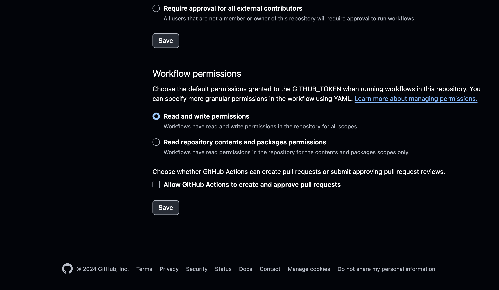
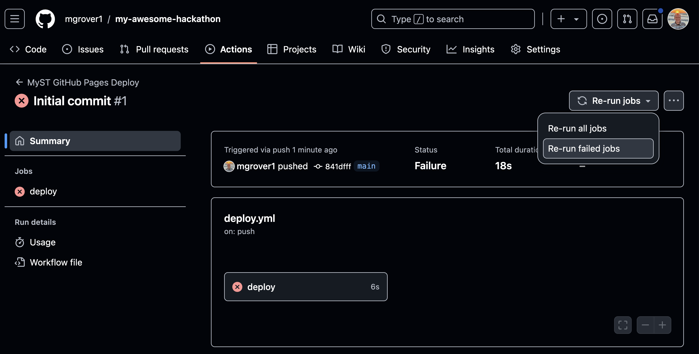
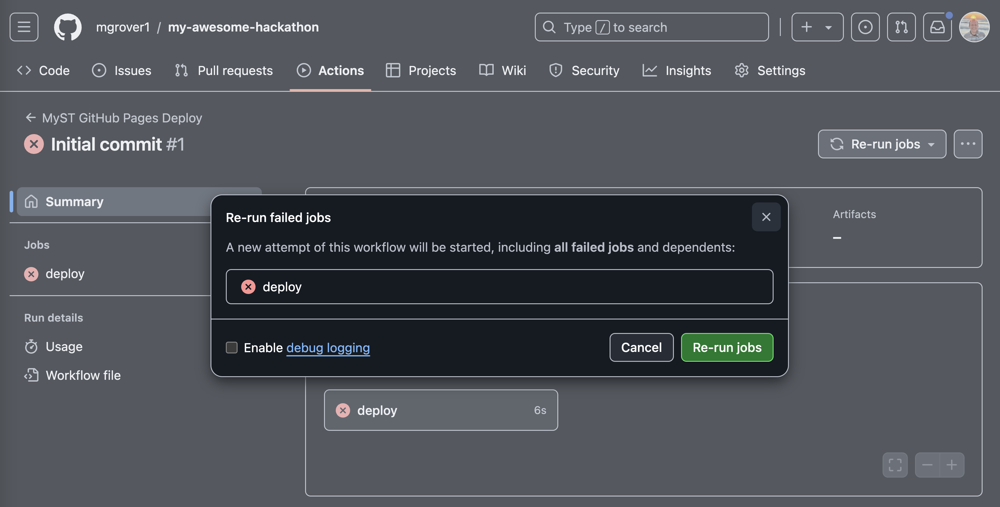
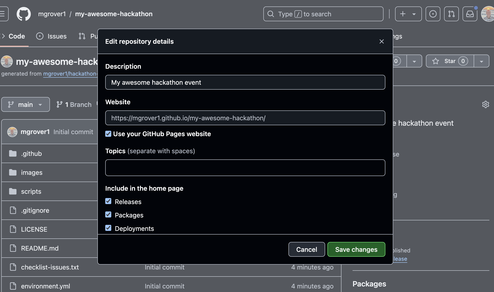
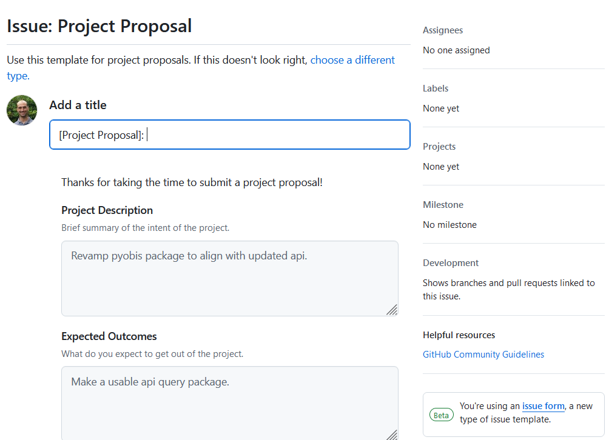
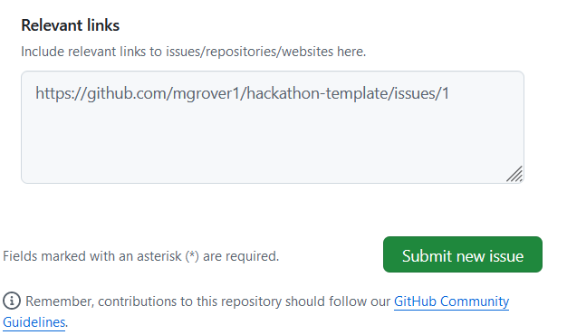

# Getting Started

## How to Deploy on Github Pages
By default, your website will be deployed to github pages, using the path of:

mgrover1.github.io/hackathon-template-github

In order for this to work, you will need to follow these steps:

### 1. Make sure Github Actions has permission to write to your repository

This setting can be found under Settings -> Actions -> General -> Workflow Permissions


If you scroll to the bottom of the General Actions Permission, select "Read and write permissions", which will ensure your action is enabled correctly, publishing your content!


### 2. Enable Github Pages for your repository

Continue to scroll down your page, and select "Pages", which give you an option of where to gather your content from. 

Select "Github Actions", which will pull the website from the action.


### 3. Rerun the Action now that settings have been properly configured.

Go to the top of your screen, and select Actions, which will have two options on the left. 


Select the "MyST Github Pages Deploy", and select the failing action.



Click the Re-run jobs tab at the top, and select re-run failed jobs


Click the Re-run jobs button, which will initiate the publishing.



### 4. Make sure your pages link is linked on your repository

Go to the main page for your repository (ex. https://github.com/mgrover1/hackathon-template-github)

Notice the gear logo on the right - click on that! (this should be to the right of the About section)


Make sure the "Use your Github Pages website" is selected.



Follow that link, you are good to go! Congratulations on deploying your first hackathon website 🚀

## How to Edit Content

All of the content for this template is built from markdown, a plain text format that is used to build the web content!

For more on markdown, please see this [markdown tutorial](https://www.markdowntutorial.com/)

### Editing Content on Github

If you are interested in editing the content directly on the github website, please see [this tutorial](https://docs.github.com/en/get-started/start-your-journey/hello-world) that walks through Github

### Editing Content Locally

If you are interested in editing/rendering this content locally, please follow these steps:

1. Move into your directory of the content

```bash
cd hackathon-template-github
```

2. Install a conda environment using the environment file*

* if you are new to conda environments, please see this [getting started with conda content from the software carpentries](https://edcarp.github.io/introduction-to-conda-for-data-scientists/02-working-with-environments/index.html)

```bash
conda env create -f environment.yml
conda activate hackathon-template-github-dev
```

3. Build your content locally using myst (and open the link returned)

```bash
myst start
```

Running this command will start up your website, which should look something like:

```👉  http://localhost:3000  👈```

4. Edit your content

Now, you can open your README.md in your editor of choice, and add/remove/change the content, which will render immediately within your browser


## How to propose projects

For each project, submit a Project Proposal to this repository, identifying the scope of that topic. This will help ensure each project has a plan that can be executed during the event.

To submit topics of interest use the GitHub issue form below:

mgrover1/hackathon-template-github/issues/new/choose

1. Select the project proposal issue template.


2. Populate the issue form:



3. Submit new issue

